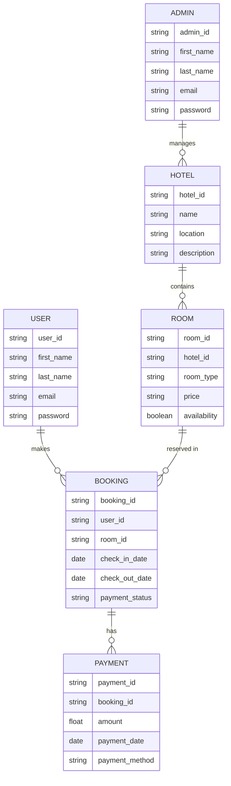

## Hotel Management System
- This repository contains the source code for a hotel management app built using Flutter.
-  The app provides comprehensive management features for hotel administrators and users.
-  Administrators can manage rooms, bookings, and user accounts, while users can make bookings, view their reservations, and provide feedback.
-  The app includes authentication functionality for both admins and users, ensuring secure access to the app's features.
-  It offers a user-friendly interface, smooth navigation, and seamless integration with backend services.
-   Whether you're a hotel owner looking to streamline operations or a traveler seeking a convenient booking experience, this app serves as an efficient solution for managing hotel activities.
## Description
- This is a hotel booking application built with Flutter.
- It allows users to search for hotels, view hotel details, and make bookings.

## Abstract

This documentation provides a comprehensive overview of the development and functionality of a hotel booking website. The project is designed to offer users an intuitive and seamless experience for searching, selecting, and booking hotel accommodations. Key features include a user-friendly interface, advanced search and filter options, secure payment processing, and robust administrative tools for hotel management.

The system architecture leverages modern web technologies to ensure scalability, reliability, and responsiveness. This documentation covers the technical specifications, implementation details, and user guides necessary to understand and utilize the hotel booking platform effectively.

## Declaration

I, Abraham Kiplagat, a student of the Institute of Software Development, hereby declare that the project entitled "Hotel Management System" is my original work and has not been submitted for any other degree or examination.

I further declare that to the best of my knowledge and belief, the content of this project does not infringe the intellectual property rights of any other person belonging to the diploma Software Development day class.

I understand that any act of plagiarism or academic dishonesty, as defined by Institute of Software Development regulations, will result in severe penalties.

Signed,

Abraham Kiplagat.

## Problem Statement

The process of booking hotel accommodations can often be cumbersome and inefficient for travelers. Traditional booking methods and some existing online platforms lack user-friendly interfaces, comprehensive search capabilities, and real-time availability updates. These issues can lead to user frustration, wasted time, and potential revenue loss for hotels due to booking errors and double bookings. Additionally, hotel administrators face challenges in managing reservations, inventory, and customer data efficiently.

## Proposed Solutions

This project proposes the development of a robust hotel booking website designed to streamline the booking process for users while providing powerful management tools for hotel administrators.
The platform will feature an intuitive user interface that allows travelers to effortlessly search for hotels based on regions.

For hotel administrators, the website will include a comprehensive management dashboard to handle reservations, monitor room inventory, and manage customer data efficiently. Secure payment processing and automated confirmation systems will reduce the risk of booking errors and enhance user trust. By integrating these features, the proposed solution aims to create a seamless and efficient booking experience for users and a powerful management tool for hoteliers.

## Entity-Relationship Diagram (ERD)

## How to Use the System

### For Users
1. **Search for Hotels:** Enter your desired hotel name location to search for available hotels.
2. **Filter Results:** Use advanced filters to narrow down your search based on price, amenities, ratings, etc.
3. **Select and Book:** Choose a hotel and room, then proceed to the booking process.
4. **Secure Payment:** Complete the payment using secure online payment methods.
5. **Confirmation:** Receive an automated booking confirmation via email.

### For Hotel Administrators
1. **Dashboard Access:** Log in to the admin dashboard using your credentials.
2. **Manage Reservations:** View, add, or modify reservations.
3. **Monitor Room Inventory:** Keep track of room availability and manage room details.
4. **Manage Customer Data:** Access and update customer information as needed.
5. **View Reports:** Generate and view reports on bookings, payments, and customer data.

## Technical Specifications

1. **Frontend and Backend:** Flutter (Dart)
2. **Database:** Firebase
3. **Payment Gateway:** Paystack
4. **Version Control:** Git and GitHub
5. **Deployment:** GitHub Pages

## Features

1. **Hotel Search:** Users can search for hotels based on Hotel name.
2. **Hotel Details:** Users can view detailed information about each hotel, including amenities, photos, and reviews.
3. **Booking:** Users can make bookings for selected hotels, specifying the number of guests and room preferences.
4. **User Authentication:** Users can create accounts and log in to access personalized features, such as saved bookings and preferences.
5. **Payment Integration:** Users can securely make payments for their bookings using popular payment gateways.
6. **Admin Dashboard:** Manage rooms, bookings, and user accounts.
7. **User Dashboard:** Make bookings, view reservations, and provide feedback.
8. **Authentication:** Secure login for both admins and users.
9. **Intuitive UI:** User-friendly interface for easy navigation.

## Acknowledgment

I would like to express my sincere gratitude to my instructors at the Institute of Software Development for their guidance and support throughout this project, including:

- Mr. Edward Kabue
- Mr. Sam Siragu

Special thanks to my family and friends for their encouragement and patience during the development of this project.

## Contact

For any queries or support, please contact:

- Name: Abraham Kiplagat
- Email: kurerelagat01@gmail.com

